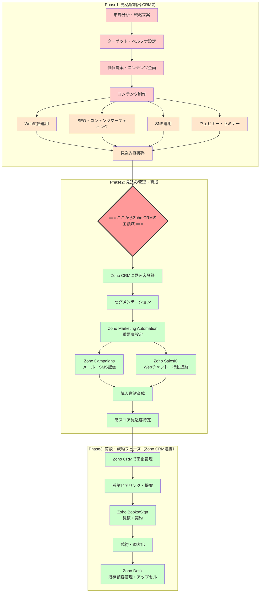

## **Mermaidフローチャート**

### **新規顧客獲得におけるZoho CRMの正しい役割**

**重要な前提：CRMは「管理・発信ツール」であり「創出ツール」ではありません**

CRM（Customer Relationship Management）は文字通り **「顧客関係管理」** システムです。既に獲得した見込み客を効率的に管理・育成し、成約に導くための強力なツールですが、ゼロから顧客を「生み出す」機能は持っていません。新規顧客獲得は、以下の3つのフェーズで構成される包括的なプロセスです。

### **新規顧客獲得の3つのフェーズ**

**Phase 1: 見込客創出フェーズ（CRM導入前の重要な基盤）**

このフェーズでは、まだ貴社を知らない潜在顧客にアプローチし、興味を持ってもらうことが目標です。ここでの成功が後続のCRM活用の成否を決定します。

市場分析・戦略立案では、競合他社の動向分析、市場ニーズの詳細な把握、金融業界特有の規制環境の理解を通じて、最適なマーケティング戦略を策定します。ターゲット設定においては、年齢、職業、年収、家族構成、投資経験、リスク許容度といった具体的な顧客像（ペルソナ）を明確に設定し、誰に情報を届けるべきかを定めます。

価値提案の策定では、なぜ貴社を選ぶべきか、貴社が提供できる独自の価値や差別化要因を明確に言語化します。コンテンツ制作では、「老後資金2000万円問題の解決策」「ライフステージ別資産形成術」といった、ターゲットの具体的な課題を解決し、興味を引く高品質な情報コンテンツを作成します。

集客活動では、Web広告、SEO、SNS運用、ウェビナーやセミナーといった多様なチャネルを通じて、ターゲットへの認知度向上と具体的な見込客獲得を目指します。

- **使用ツール**: Google広告、SNSプラットフォーム、CMS、ウェビナーツール等
- **担当**: 人間（戦略・企画・実行）+ 生成AI（コンテンツドラフト・分析支援）

**Phase 2: 見込客管理・育成フェーズ（Zoho CRMの主戦場）**

ここからがZoho CRMの真価が発揮される場面です。獲得した見込客を効率的に管理し、購買意欲を段階的に高めていきます。

Zoho CRMでの一元管理により、全ての集客チャネルから獲得した見込客情報を統合し、情報の散逸を防ぎながら全体像を把握します。セグメンテーションでは、見込客の属性や行動履歴に基づく詳細なグループ分けを行い、よりパーソナライズされたアプローチを可能にします。

Zoho Marketing Automationによるスコアリングでは、見込客の行動（Webサイト訪問、メール開封、資料ダウンロードなど）に応じて自動的にスコアを付与し、購買確度の高い見込客を特定します。Zoho Campaignsでの自動配信では、セグメント別に最適化されたパーソナライズメールやSMSを適切なタイミングで配信します。

Zoho SalesIQでの行動追跡により、見込客のWebサイト行動をリアルタイムで可視化し、Webチャット機能を通じて適切なタイミングでのコミュニケーションを実現します。継続的なナーチャリングでは、これらの情報を基に価値ある情報を継続的に提供し、購買への意欲を高めていきます。

**Phase 3: 商談・成約フェーズ（Zoho CRM連携）**

育成された見込客を具体的な商談へ発展させ、成約に導きます。商談管理では、Zoho CRM内で商談の進捗状況、担当者、金額、次のアクションを一元的に管理し、営業プロセス全体を可視化します。

営業支援では、顧客の過去のやり取り、行動履歴、関心のある商品など、CRMに蓄積された情報を活用することで、営業担当者はより効果的なヒアリングや提案を行えます。契約プロセスでは、Zoho BooksやZoho Signとの連携により、見積もりから契約締結までを効率化し、迅速な対応を可能にします。

既存顧客管理では、成約後もCRMで顧客情報を継続管理し、アップセルやクロスセルといった継続的なビジネス機会を創出します。

### **保険・資産運用業界での特別な考慮事項**

保険・資産運用業界では、以下の点が特に重要となります。

コンプライアンスでは、金融商品取引法や保険業法などの厳格な法規制に基づいた適切な情報表示、記録保持、説明責任が求められます。CRMの活用においても、これらの要件を満たす運用が不可欠です。

信頼構築では、顧客にとって極めて重要な意思決定となるため、専門性を示すコンテンツ提供と透明性のある情報開示を通じて、強い信頼関係を構築することが成功の鍵となります。

長期関係では、単発の商品販売に留まらず、顧客のライフプランニングを支援するパートナーとして長期的な関係性を築き、継続的なサービス提供を目指します。パーソナライゼーションでは、顧客のライフステージ、家族構成、リスク許容度、資産状況などに応じた極めて個別最適化された提案が求められます。

### **各ツール・人材の最適な役割分担**

**人間（マーケター・営業）の担当**では、市場分析に基づく戦略立案、ターゲット設定、価値提案の策定を行います。また、コンプライアンスに関する最終判断、顧客との信頼関係構築と維持、複雑な顧客課題に対するヒアリング、個別具体的な提案、商談のクロージングを担当します。

**生成AIの活用領域**では、市場データや顧客行動の分析支援、コンテンツのドラフト作成、SEOキーワードの選定を行います。また、セグメント別に最適化されたメール文面や広告コピーの自動生成、顧客行動データに基づいた次のアクションの提案を担当します。

**Zoho CRMスイートの役割**は、見込客創出支援としてZoho Social（SNS運用管理）、Zoho Sites（ランディングページ作成）があります。CRM中核機能として、見込客管理、見込客スコアリング、マーケティングオートメーション、商談管理、顧客データ分析を担当します。成約支援では、Zoho Books（見積書作成）、Zoho Sign（電子署名）を活用し、顧客管理では、Zoho Desk（顧客サポート）、Zoho Analytics（詳細なデータ分析とレポート）を使用します。

### **実践的な導入ステップ**

導入は以下の4段階で進めることを推奨します。

1. **現状分析**では、現在の集客チャネルの効果測定、既存コンテンツの棚卸し、Zoho CRMの現状設定確認と課題洗い出しを行います。

2. **基盤構築**では、ターゲット顧客に響く魅力的なオファー（無料診断、シミュレーターなど）の作成、ランディングページの最適化、CRM内での見込客スコアリングとナーチャリングシナリオの設定を実施します。

3. **集客開始**では、検索広告・SNS広告の運用開始、SEOを意識したコンテンツの継続発信、オンライン・オフラインでのウェビナーやセミナーの実施を行います。

4. **効果測定・改善**（継続）では、各マーケティング活動や営業プロセスのコンバージョン率を詳細に測定し、A/Bテストによる最適化、ROI分析に基づいた予算配分や戦略の継続的な調整を実施します。

### **まとめ**

Zoho CRMは新規顧客獲得プロセスの「効率化と最適化」において極めて強力なツールですが、そもそもの見込客創出には別途マーケティング活動が不可欠です。高野さんのお考えの通り、「魅力的なコンテンツ作成→ターゲット設定→CRMでの管理・配信」というフローが正解であり、これが業界標準のベストプラクティスです。

クライアントには、
**CRMの価値を最大化するためには、まず質の高い見込客創出活動が前提となる**
ことを、このフローチャートと説明文を用いて明確にお伝えください。CRMは **優れた「管理・育成ツール」** であり、適切に活用すれば新規顧客獲得の効率を大幅に向上させることができますが、その前提として戦略的なマーケティング活動が必要であることを理解していただくことが重要です。