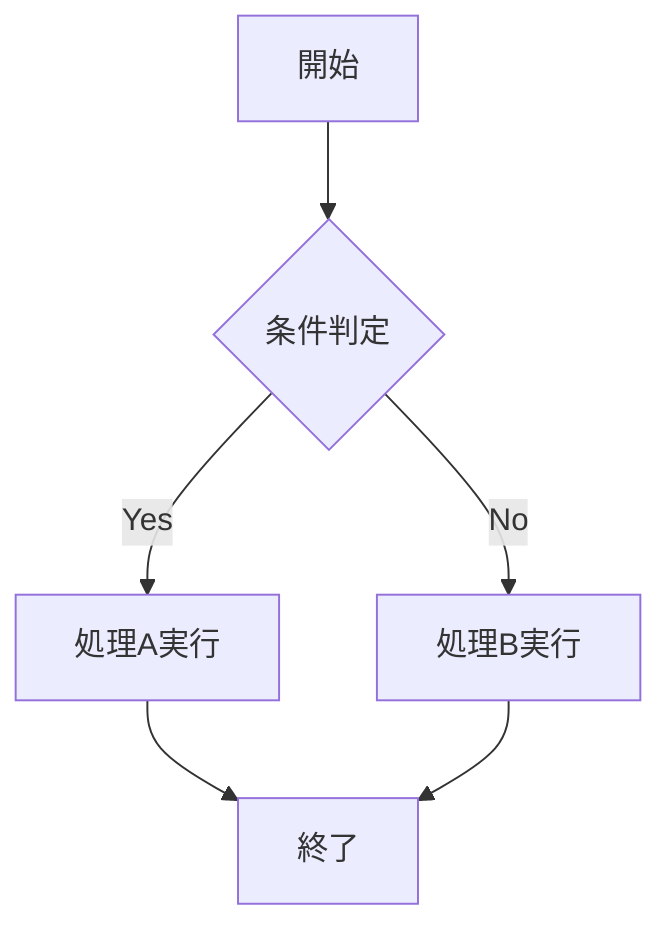
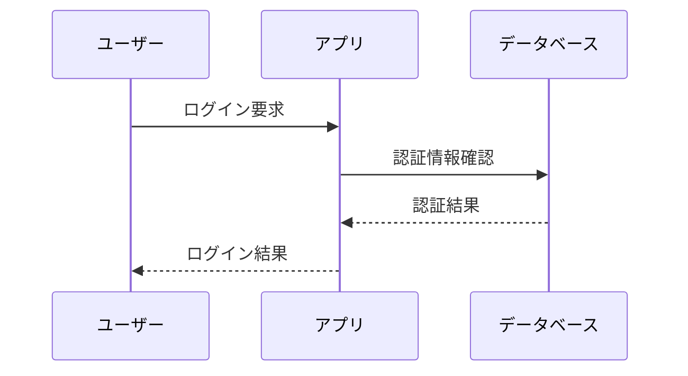
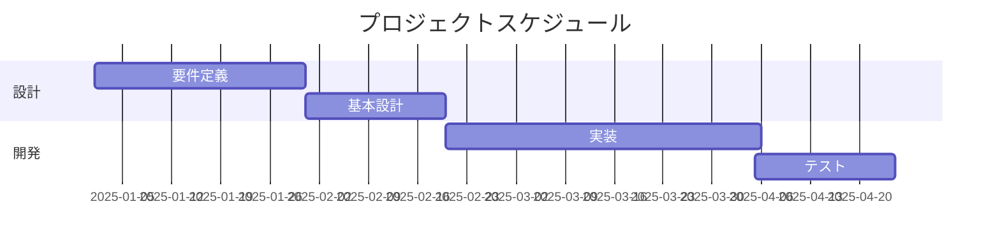
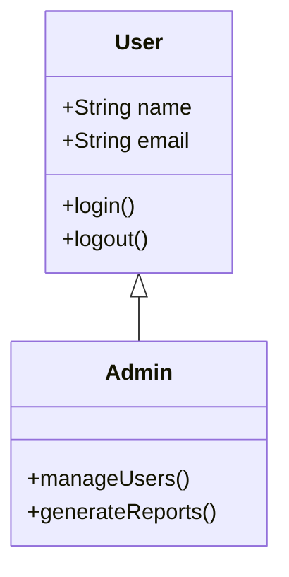

```markdown
---
title: "Markdown学習ガイド"
author: "開発チーム"
date: "2025-01-07"
version: "1.0"
tags: ["Markdown", "学習", "ガイド", "VS Code", "Obsidian"]
status: "完成"
---

# **Markdown学習ガイド：効率的な文書作成のために**

このガイドは、VS Code・Obsidian・Notionの統合環境でMarkdownを効率的に活用するための実践的な手引きです。

---

## **目次**

1. [Markdownとはなにか](#markdownとはなにか)
2. [Markdown記法を使うメリット](#markdown記法を使うメリット)
3. [Markdownの基本的書き方](#markdownの基本的書き方)
4. [Markdownの応用的書き方](#markdownの応用的書き方)
5. [文字以外の要素（図形・画像等）の挿入方法](#文字以外の要素図形画像等の挿入方法)
6. [さらに身につけるべきスキル](#さらに身につけるべきスキル)

---

## **Markdownとはなにか**

**Markdownは軽量マークアップ言語**です。2004年にJohn Gruberによって開発され、プレーンテキストで文書の構造と装飾を直感的に表現できます。

### **主な特徴**

**シンプルな記法：** `#`で見出し、`**`で太字など、覚えやすい記号を使用  
**高い可読性：** マークアップした状態でも内容が理解しやすい  
**汎用性：** HTML、PDF、Word等、様々な形式に変換可能  
**プレーンテキスト：** どんなエディタでも編集可能、軽量でバージョン管理に最適

### **主な用途**

- **技術文書：** API仕様書、設計書、開発記録、README
- **知識管理：** Wiki、調査ノート、学習記録
- **プロジェクト文書：** 議事録、提案書、レポート
- **ブログ・記事：** 構造化された文章作成

---

## **Markdown記法を使うメリット**

### **作業効率の大幅向上**

**高速な文書作成：** キーボードから手を離すことなく、構造化された文書を作成  
**体裁調整の自動化：** 見た目の調整に時間を取られず、内容に集中  
**一度書けば多用途：** 同じファイルからHTML、PDF、Notionページを生成

### **品質と保守性の向上**

**一貫した体裁：** 自動的に統一されたフォーマットを維持  
**バージョン管理適性：** Gitで変更履歴を正確に追跡、差分比較が容易  
**検索性：** プレーンテキストのため、全文検索が高速・正確

### **チーム協業の促進**

**プラットフォーム独立：** Windows、Mac、Linuxで同じように表示  
**ツール依存なし：** VS Code、Obsidian、Notion、GitHub等で共通利用  
**軽量性：** ファイルサイズが小さく、共有・保存が効率的

### **学習コストの低さ**

**直感的な記法：** 30分程度で基本操作を習得可能  
**段階的習得：** 必要に応じて高度な機能を追加学習  
**豊富なサポート：** VS Code拡張機能、Obsidianプラグインで機能拡張

---

## **Markdownの基本的書き方**

### **見出し（文書構造の基本）**

```markdown
# 見出し1（最上位）
## 見出し2
### 見出し3
#### 見出し4
##### 見出し5
###### 見出し6（最下位）
```

**使い分けのコツ：**
- **H1（#）：** ドキュメントタイトル（1つのファイルに1つ）
- **H2（##）：** 主要セクション
- **H3（###）：** サブセクション

### **段落と改行**

```markdown
これは最初の段落です。

これは2番目の段落です。空行で段落を区切ります。

行末に半角スペース2つ  
で強制改行できます。
```

### **文字装飾**

```markdown
**太字（重要な情報）**
*斜体（強調）*
~~取り消し線（削除された内容）~~
`インラインコード（変数名、コマンド等）`
***太字かつ斜体（最重要）***
```

### **リスト（情報の整理）**

**箇条書き（順序なし）：**
```markdown
- 項目A
  - サブ項目A-1
  - サブ項目A-2
- 項目B
- 項目C
```

**番号付きリスト（順序あり）：**
```markdown
1. 第一段階
2. 第二段階
   1. サブステップ2-1
   2. サブステップ2-2
3. 第三段階
```

**チェックリスト（タスク管理）：**
```markdown
- [ ] 未完了タスク
- [x] 完了済みタスク
- [ ] 進行中のタスク
```

### **表の作り方（必須スキル）**

**基本的な表：**
```markdown
| 項目1 | 項目2 | 項目3 |
|-------|-------|-------|
| データA | データB | データC |
| データD | データE | データF |
```

**文字揃えを指定した表：**
```markdown
| 機能名 | 対応状況 | 優先度 |
|:-------|:--------:|-------:|
| ログイン機能 | 完了 | 高 |
| データ検索 | 進行中 | 中 |
| レポート出力 | 未着手 | 低 |
```

**文字揃えの指定方法：**
- `:---` → 左揃え
- `:---:` → 中央揃え  
- `---:` → 右揃え

**VS Codeでの表編集のコツ：**
- **Tab：** 次のセルに移動
- **Alt+Shift+F：** 表の自動整形
- **Markdown All in One拡張機能**で快適な表編集が可能

### **コード表示**

**インラインコード：**
```markdown
`git commit -m "add: 新機能追加"`のように実行します。
```

**コードブロック（言語指定）：**
```markdown
```python
def calculate_total(items):
    return sum(item.price for item in items)

print(calculate_total(shopping_cart))
```
```

**コードブロック（言語指定なし）：**
```markdown
```
設定ファイルの例：
server_port = 8080
debug_mode = true
```
```

### **リンクと参照**

**基本的なリンク：**
```markdown
[Google](https://www.google.com)
[プロジェクトドキュメント](../01_specs/project-overview.md)
[メール送信](mailto:example@company.com)
```

**画像の表示：**
```markdown


```

### **引用と注釈**

```markdown
> 重要なポイントや引用文を表示します。
> 複数行にわたる引用も可能です。
> 
> > ネストした引用も表現できます。
```

### **区切り線**

```markdown
---
セクションの区切りに使用
---
```

---

## **Markdownの応用的書き方**

### **VS Codeショートカット活用**

**文字装飾の高速化：**
- **太字：** `Cmd+B` (Mac) / `Ctrl+B` (Windows)
- **斜体：** `Cmd+I` (Mac) / `Ctrl+I` (Windows)
- **取り消し線：** `Cmd+Shift+X`

**構造操作の効率化：**
- **見出しレベル上げ：** `Cmd+Shift+]`
- **見出しレベル下げ：** `Cmd+Shift+[`
- **リスト作成：** `Cmd+Shift+L`
- **チェックリスト：** `Cmd+Shift+C`

**プレビューとナビゲーション：**
- **プレビュー表示：** `Cmd+Shift+V`
- **サイドプレビュー：** `Cmd+K V`
- **アウトライン表示：** `Cmd+Shift+O`

**高度な操作：**
- **画像貼り付け：** `Cmd+Alt+V`（Paste Image拡張機能）
- **目次自動生成：** `Cmd+Shift+P` → "Create Table of Contents"
- **表の整形：** `Alt+Shift+F`

### **Obsidianの特殊機能**

**内部リンク（Obsidian専用）：**
```markdown
[[他のノート名]]でリンク作成
[[ノート名#見出し]]で特定セクションへリンク
```

**埋め込み（Obsidian専用）：**
```markdown
![[他のノート名]]で内容を埋め込み
![[ノート名#見出し]]で特定セクションを埋め込み
```

### **数式記法（LaTeX）**

**インライン数式：**
```markdown
円の面積は $S = \pi r^2$ で計算されます。
```

**ブロック数式：**
```markdown
$$
E = mc^2
$$
```

**複雑な数式例：**
```markdown
$$
\sum_{i=1}^{n} i = \frac{n(n+1)}{2}
$$
```

### **高度なリンク技法**

**参照スタイルリンク：**
```markdown
詳細は[公式ドキュメント][doc]と[API仕様書][api]を参照してください。

[doc]: https://example.com/docs "公式ドキュメント"
[api]: https://api.example.com "API仕様書"
```

**アンカーリンク（同一文書内）：**
```markdown
[基本的書き方に戻る](#markdownの基本的書き方)
```

### **HTMLタグの活用**

```markdown
<kbd>Ctrl</kbd> + <kbd>C</kbd> でコピー

<details>
<summary>詳細情報（クリックで展開）</summary>

ここに詳細な内容を記述します。
- 項目1
- 項目2

</details>

上付き文字：H<sub>2</sub>O  
下付き文字：x<sup>2</sup>
```

---

## **文字以外の要素（図形・画像等）の挿入方法**

### **画像挿入の実践**

**VS Code Paste Image拡張機能の活用：**
1. **スクリーンショット撮影**（`Cmd+Shift+4` on Mac）
2. **Markdownファイル内で `Cmd+Alt+V`**
3. **自動的に`images/`フォルダに保存、パス挿入**

**設定済み環境での画像管理：**
```markdown


```

**画像サイズ調整（HTML使用）：**
```markdown


```

### **Mermaid図表作成**

**フローチャート：**
```markdown

```

**シーケンス図：**
```markdown

```

**ガントチャート：**
```markdown

```

**クラス図：**
```markdown

```

### **Notion連携での注意点**

**Mermaid図表の扱い：**
- VS CodeやObsidianでは自動表示
- **Notionでは画像化が必要**
- VS Codeでスクリーンショット → 画像として貼り付け

**数式の変換：**
- VS Code/Obsidian：`$$E=mc^2$$`のまま記述
- **Notion：**インポート後に`/equation`ブロックで手動変換

### **外部ツール連携**

**Draw.io（diagrams.net）との連携：**
1. **複雑な図表をDraw.ioで作成**
2. **SVG形式でエクスポート**
3. **Markdownに画像として挿入**

```markdown

```

**Excalidraw（手書き風図表）：**
- Obsidianプラグインで直接作成
- PNG/SVG出力でVS Codeでも利用可能

---

## **さらに身につけるべきスキル**

### **YAMLフロントマター（メタデータ管理）**

```markdown
---
title: "API仕様書"
version: "2.1"
date: "2025-01-07"
author: "開発チーム"
tags: ["API", "仕様", "REST"]
status: "承認済み"
---

# API仕様書

本文開始...
```

**活用方法：**
- **Obsidian：** プロパティとして表示・検索
- **Notion：** インポート時にデータベースプロパティに変換
- **VS Code：** 拡張機能でメタデータ表示

### **テンプレート活用術**

**VS Codeスニペット作成：**
1. **`Cmd+Shift+P` → "Configure User Snippets"**
2. **"markdown.json"選択**
3. **以下を追加：**

```json
{
  "API Spec Template": {
    "prefix": "apispec",
    "body": [
      "# API仕様書: ${1:API名}",
      "",
      "**バージョン:** ${2:1.0}  ",
      "**作成日:** ${3:YYYY-MM-DD}  ",
      "**ステータス:** ${4:ドラフト}",
      "",
      "## 概要",
      "",
      "${5:APIの概要説明}",
      "",
      "## エンドポイント",
      "",
      "### ${6:エンドポイント名}",
      "",
      "- **URL:** `${7:/api/endpoint}`",
      "- **Method:** ${8:GET}",
      "- **説明:** ${9:機能説明}",
      ""
    ]
  }
}
```

### **Git連携とバージョン管理**

**効率的なコミット：**
```bash
# 文書の変更をコミット
git add docs/
git commit -m "docs: API仕様書v2.1の更新"
git push origin main
```

**文書レビューのワークフロー：**
```bash
# フィーチャーブランチで文書作成
git checkout -b feature/api-spec-update
git add docs/api-specification.md
git commit -m "docs: API仕様書の初稿作成"
git push origin feature/api-spec-update
# プルリクエストでレビュー → マージ
```

### **品質管理とスタイル統一**

**Markdownlintルールの活用：**
既に設定済みの`.markdownlint.json`により、以下が自動チェックされます：
- 見出しレベルの適切性
- 行長制限（120文字）
- 空行の統一
- リストの整形

**文書レビューチェックリスト：**
- [ ] 見出し構造の論理性
- [ ] リンクの動作確認
- [ ] 画像の表示確認
- [ ] 表の整形状態
- [ ] Markdownlintエラーの解消
- [ ] 誤字脱字チェック

### **Notion統合ワークフロー**

**効率的なインポート手順：**
1. **VS Code/Obsidianで文書作成・完成**
2. **画像パスを相対パスで統一**
3. **Notion：Import → Markdown & CSV**
4. **数式を`/equation`ブロックに変換**
5. **Mermaid図表を画像化して添付**

**データベース活用：**
- **文書管理DB：** ソース、カテゴリ、ステータス、更新日
- **知識DB：** 分野、タグ、参照頻度、公開レベル

### **チーム運用のベストプラクティス**

**命名規則の統一：**
```
技術文書：YYYY-MM-DD_project-name_document-type.md
会議資料：YYYY-MM-DD_meeting-type_topic.md
調査資料：YYYY-MM-DD_research-topic.md
```

**フォルダ構造との連携：**
- **01_specs/：** 技術仕様書、設計書
- **02_reports/：** 分析レポート、調査結果  
- **03_meetings/：** 議事録、会議資料
- **04_proposals/：** 提案書、企画書
- **05_research/：** 調査ノート、学習記録

---

## **学習チェックリスト**

### **基本スキル（Week 1）**
- [ ] 見出し・段落・リストの作成
- [ ] 表の作成と文字揃え設定
- [ ] 画像の挿入（Paste Image活用）
- [ ] VS Codeショートカットの習得
- [ ] 基本的なコードブロック作成

### **応用スキル（Week 2）**
- [ ] Mermaidフローチャート作成
- [ ] 数式記法（LaTeX）の活用
- [ ] 内部リンク・参照リンクの作成
- [ ] HTMLタグの適切な使用
- [ ] テンプレート・スニペットの作成

### **統合活用（Week 3）**
- [ ] Git連携でのバージョン管理
- [ ] Notion連携（インポート・調整）
- [ ] Markdownlintでの品質管理
- [ ] チーム向け文書の標準化
- [ ] 複雑な図表の作成・管理

### **マスターレベル（Week 4）**
- [ ] 自動化ワークフローの構築
- [ ] 大規模文書プロジェクトの管理
- [ ] 多言語対応・国際化
- [ ] パフォーマンス最適化
- [ ] アクセシビリティ対応

---

**このガイドを活用して、効率的で高品質な文書作成環境を構築し、チーム全体の生産性向上を実現してください。**

**具体的な質問や、特定の業務要件への適用については、遠慮なくお聞かせください。**
```

---

このガイドをプロジェクトフォルダの`docs/00_templates/markdown_learning_guide.md`として保存してください。TAKさんの既存環境（VS Code拡張機能、Obsidian設定、Notion連携）を最大限活用し、段階的に習得できる構成になっています。

実際に使用してみて、特定の部分についてより詳しい説明が必要でしたら、遠慮なくお聞かせください。